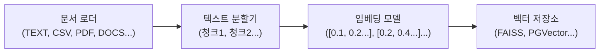
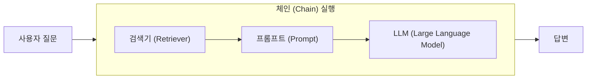

## RAG(Retrieval-Augmented Generation)

**요약**: RAG(Retrieval-Augmented Generation)는 대규모 언어 모델(LLM)의 한계를 보완하여, 외부 지식 기반에서 정보를 검색하고 이를 바탕으로 더욱 정확하고 신뢰성 높은 답변을 생성하는 기술이다. RAG는 LLM의 환각 현상, 최신 정보 및 특정 도메인 지식 부족 문제를 해결하며, 정보 검색 및 생성의 두 단계를 거쳐 작동한다. 문서 로더, 텍스트 분할기, 임베딩 모델, 벡터 저장소가 주요 구성 요소이며, 이를 통해 답변의 정확성 향상, 환각 감소, 투명성 제공, 그리고 유연성이라는 이점을 얻을 수 있다.

### RAG란 무엇인가?

RAG는 대규모 언어 모델(LLM)이 외부 지식 기반에서 정보를 검색하여 답변을 생성하는 기술이다. LLM은 방대한 데이터를 학습하지만, 최신 정보나 특정 도메인 지식에 대한 한계가 있을 수 있다. RAG는 이러한 LLM의 한계를 보완하여, 더욱 정확하고 풍부한 답변을 제공할 수 있도록 돕는 기술이다.

### RAG가 왜 필요한가?

기존 LLM은 학습 데이터에 기반하여 답변을 생성한다. 이로 인해 다음과 같은 문제가 발생할 수 있다.

1.  **환각(Hallucination)**: LLM이 사실과 다른 내용을 마치 사실인 것처럼 생성하는 현상이다.
2.  **최신 정보 부족**: LLM은 특정 시점까지의 데이터로 학습되므로, 그 이후의 최신 정보에 대해서는 알지 못하는 한계가 있다.
3.  **특정 도메인 지식 부족**: 일반적인 지식은 풍부하지만, 특정 전문 분야의 지식은 부족할 수 있다.

RAG는 이러한 문제를 해결하기 위해, 질문과 관련된 정확한 정보를 외부에서 찾아 LLM에게 제공하여 답변의 신뢰성과 정확성을 높이는 데 도움을 주는 것이다.

### RAG 작동 방식

RAG는 크게 두 가지 단계로 작동한다.

1.  **정보 검색(Retrieval)**: 사용자의 질문을 이해하고, 질문과 관련된 정보를 외부 지식 기반(예: 문서 데이터베이스, 웹 페이지)에서 검색하는 단계이다.
2.  **생성(Generation)**: 검색된 정보를 바탕으로 LLM이 질문에 대한 답변을 생성한다. 이때, LLM은 검색된 정보를 참고하여 더욱 정확하고 관련성 높은 답변을 만드는 단계이다.

### RAG의 주요 구성 요소

RAG는 일반적으로 다음 네 가지 주요 구성 요소를 가지고 있다.

1.  **문서 로더(Document Loader)**: 다양한 형식의 문서(PDF, 웹 페이지, 텍스트 파일 등)를 로드하는 역할을 하는 구성 요소이다.
2.  **텍스트 분할기(Text Splitter)**: 로드된 문서를 작은 단위(청크)로 분할한다. 이는 검색 효율성을 높이기 위한 것이다.
3.  **임베딩 모델(Embedding Model)**: 분할된 텍스트 청크를 벡터(숫자 배열)로 변환한다. 이 벡터는 텍스트의 의미를 나타내며, 벡터 공간에서 유사한 의미를 가진 텍스트는 가깝게 위치하는 것이다.
4.  **벡터 저장소(Vector Store)**: 임베딩된 텍스트 벡터를 저장하고, 검색 시 질문 벡터와 유사한 벡터를 찾아 반환하는 저장소이다.

### RAG의 이점

RAG는 다음과 같은 이점을 제공한다.

- **정확성 향상**: 최신 정보와 특정 도메인 지식을 활용하여 더욱 정확한 답변을 생성할 수 있다.
- **환각 감소**: 외부에서 검색된 실제 정보를 기반으로 답변을 생성하므로, LLM의 환각 현상을 줄일 수 있다.
- **투명성 제공**: 답변의 출처를 제공하여 사용자가 정보의 신뢰성을 확보할 수 있다.
- **유연성**: 새로운 정보가 추가되더라도 LLM을 재학습할 필요 없이 외부 지식 기반만 업데이트하면 된다.

### RAG의 런타임 단계

RAG는 데이터 준비 및 색인 과정 이후, 사용자 질문에 대한 답변을 생성하기 위해 다음과 같은 런타임 단계를 거친다.

1.  **검색기 (Retriever)**: 사용자 질문이 주어지면, 이와 관련된 벡터를 벡터 저장소(데이터베이스)에서 검색하는 단계이다. 이는 질문에 가장 잘 맞는 책의 챕터를 찾는 과정과 유사하다.
2.  **프롬프트 (Prompt)**: 검색된 정보를 바탕으로 언어 모델이 이해하고 답변을 생성할 수 있도록 질문을 구성하는 단계이다. 즉, 정보를 바탕으로 어떻게 질문할지 결정하는 과정이다.
3.  **LLM (Large Language Model)**: 구성된 프롬프트를 사용하여 언어 모델이 최종 답변을 생성하는 단계이다. 이는 수집된 정보를 바탕으로 과제나 보고서를 작성하는 학생과 같은 역할을 한다.
4.  **체인(Chain) 실행**: 사용자 질문에 따라 검색기, 프롬프트, LLM 호출 등 모든 과정을 하나의 파이프라인으로 묶어 실행하고 조율하는 단계이다.

